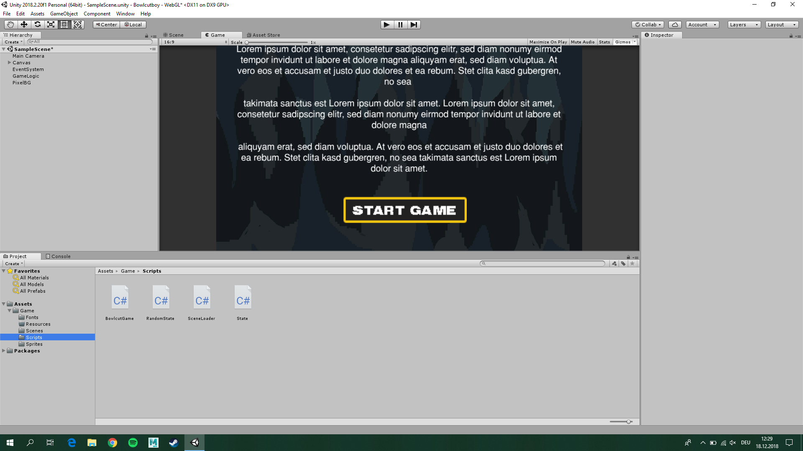

# THE ADVENTURES OF BOWLCUTBOY

The adventures of Bowlcutboy is a text adventure game in which Bowcutboy has to defeat Dr.Dr. Rottlinger. Bowlcutboy can borrow the superpowers from other superheroes to be prepared for any attack from Dr.Dr. Rottlinger! Help him!!

## Made with Unity version 2018.2.20f1

### Made by 
* https://github.com/Re1ni
* https://github.com/julelies
* https://github.com/therealunrealj
* https://github.com/kevinbulay

## please don't use any of our graphic work

## Update 20.12.18
* Es haben alle gleichermaßen am Projekt mitgearbeitet und dazu beigetragen, dass wir an dem Punkt stehen, an dem wir heute sind. 
* Uns ist natürlich sehr wohl bewusst, dass wir weiter sein könnten, als wir zum jetzigen Stand sind. Wir hätten zu Beginn nicht so viel Zeit mit der Konzeption und Co. verschwenden dürfen. Auch wären wir ein ordentliches Stück weiter, wären wir besser im Programmieren und hätten nicht währendessen viele andere Projekte und Arbeiten abschließen müssen.
* Die Dokumentation wurde heute erfolgreich von Julian gepusht und ist, bis zum letzten Tag an dem gearbeitet wurde, vollständig.
* Die fehlenden Objekte wie Skizzen und weiteres wird versucht, noch hochzuladen.
* Das ReadMe wurde auch heute von Julian erweitert und "vervollständigt".
